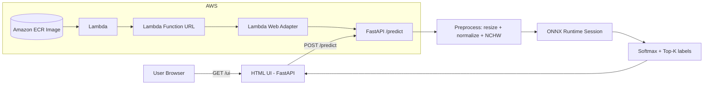

# ImageNet ResNet‑50: Training, Grad‑CAM Analysis, and Serverless ONNX Inference on AWS Lambda

An end‑to‑end workflow around an ImageNet‑1K **ResNet‑50** model covering a PyTorch training pipeline, Grad‑CAM explainability analysis, and a production‑style inference service deployed to **AWS Lambda** via **Amazon ECR**.

---

## Architecture

A single Docker container image runs **Uvicorn** (ASGI server), **FastAPI** (HTTP API + HTML UI), and **ONNX Runtime** (CPU inference). AWS **Lambda Web Adapter** converts Lambda events into HTTP requests forwarded to the Uvicorn server inside the container.



---

## Repository Layout

```text
imagenet_inference/
├── app/
│   ├── main.py                          # FastAPI + ONNX Runtime + HTML UI
│   ├── resnet50_imagenet_1k_final.onnx
│   └── labels.txt                       # ImageNet‑1K labels
├── Dockerfile
└── requirements.txt
```

Training utilities, Grad‑CAM analysis scripts, and benchmarks live in the training section of the repository (see `imagenetreport.py`).

---

## Training Pipeline

ResNet‑50 is a 50-layer residual network that uses skip connections to combat vanishing gradients, making deep supervised learning tractable. The pipeline applies several speed techniques to maximize GPU utilization during ImageNet‑1K training.

- **Config system** via CLI + Python
- **Progressive resize** — training begins on smaller images and gradually increases resolution, reducing early-epoch compute while preserving final accuracy
- **AMP** (FP16/BF16) — automatic mixed precision halves memory bandwidth and leverages Tensor Core acceleration on modern GPUs
- **`torch.compile`** — traces the model into an optimized computation graph via TorchDynamo + Inductor, reducing Python overhead
- **DDP** — Distributed Data Parallel replicates the model across GPUs and synchronizes gradients via all-reduce after each backward pass

---

## Model Analysis: Grad‑CAM

Gradient-weighted Class Activation Mapping (Grad‑CAM) backpropagates the gradient of a target class score into the last convolutional layer, then computes a weighted sum of the feature maps to produce a coarse spatial heatmap. Because the final conv layer retains the most semantic spatial structure before global pooling, its activations reliably indicate *where* the model is looking. This serves as a lightweight sanity check that the model attends to the object rather than spurious background correlations.

**Workflow:**

1. Run inference on a batch of validation images.
2. Compute Grad‑CAM heatmaps from the last convolutional block (`layer4` in ResNet‑50).
3. Upsample heatmaps to input resolution, overlay on original images, and export a grid for visual review.


---

## Inference Service

ONNX (Open Neural Network Exchange) is an open format that serializes a trained model's computation graph in a runtime-agnostic way. **ONNX Runtime** executes this graph with backend-specific optimizations (kernel fusion, memory planning) without requiring the original training framework. Exporting from PyTorch to ONNX strips training-only ops and freezes weights, resulting in a smaller, faster artifact well-suited for serverless CPU inference.

### Endpoints

| Method | Path | Description |
|--------|------|-------------|
| `GET` | `/ui` | HTML UI — upload, preview, and view top‑5 predictions |
| `POST` | `/predict` | Multipart inference endpoint (field: `file`) |
| `GET` | `/health` | Health check |

### Run Locally with Docker

```bash
# From imagenet_inference/
docker build -t imagenet-lambda-ui .
docker run --rm -p 9000:8080 imagenet-lambda-ui
```

Open the UI at http://localhost:9000/ui.

```bash
# Health check
curl -i http://localhost:9000/health

# Predict
curl -i -X POST \
  -F "file=@/path/to/image.jpg" \
  http://localhost:9000/predict
```

---

## Deployment on AWS Lambda

AWS Lambda is an event-driven, serverless compute service that runs container images up to 10 GB directly from ECR. It scales to zero when idle and provisions execution environments on demand, making it cost-effective for low-to-medium traffic inference workloads. The **Lambda Web Adapter** sidecar bridges the gap between Lambda's invocation model and conventional HTTP servers, allowing a standard FastAPI/Uvicorn app to run unmodified inside a Lambda container.

### Prerequisites

- AWS account with IAM permissions for **ECR** and **Lambda**
- AWS CLI configured (`aws configure`, region: `ap-south-1`)
- Docker or Podman

---

### Step 1 — Create an ECR Repository

Amazon Elastic Container Registry (ECR) is a fully managed OCI-compliant registry. Creating a repository establishes a namespace within your account where tagged image versions are stored and versioned. Lambda pulls directly from ECR within the same region, avoiding egress costs and latency.

```bash
REGION=ap-south-1
REPO_NAME=imagenet-lambda-ui
ACCOUNT_ID=$(aws sts get-caller-identity --query "Account" --output text)
ECR_REGISTRY=$ACCOUNT_ID.dkr.ecr.$REGION.amazonaws.com
ECR_URI=$ECR_REGISTRY/$REPO_NAME

aws ecr create-repository \
  --repository-name $REPO_NAME \
  --region $REGION 2>/dev/null || true
```


---

### Step 2 — Authenticate with ECR

ECR uses short-lived SigV4-signed tokens (valid for 12 hours) rather than static credentials. The CLI fetches a temporary password from the AWS Security Token Service and pipes it directly to `docker login`, so no credentials are written to disk in plaintext. Always refresh before pushing.

> ECR auth tokens expire — rerun this before each push.

```bash
aws ecr get-login-password --region $REGION \
  | docker login --username AWS --password-stdin $ECR_REGISTRY
```

---

### Step 3 — Build and Push the Docker Image

Docker builds a layered image from the `Dockerfile`, where each instruction creates an immutable layer cached by content hash. Tagging with a timestamp-based string (rather than overwriting `latest`) ensures each deployment is uniquely addressable and rollback is trivial. Only changed layers are transmitted on push; the ONNX model layer is large but only re-uploaded when the model file itself changes.

```bash
docker build -t imagenet-lambda-ui .

TAG=htmlui-$(date +%Y%m%d-%H%M%S)
docker tag imagenet-lambda-ui:latest $ECR_URI:$TAG
docker push $ECR_URI:$TAG

echo "Pushed: $ECR_URI:$TAG"
```

Verify the tag was pushed:

```bash
aws ecr describe-images \
  --repository-name $REPO_NAME \
  --region $REGION \
  --query "imageDetails[?contains(imageTags, '$TAG')].[imageTags,imageDigest]" \
  --output json
```

---

### Step 4 — Create the Lambda Function

Lambda's container image support allows functions up to 10 GB, making it feasible to bundle large ML models. The function is backed by an execution environment (a micro-VM managed by Firecracker) that is initialized on first invocation — the **cold start** — and kept warm for subsequent requests within the idle timeout. Setting memory to 1024 MB also increases the vCPU allocation proportionally, which speeds up ONNX Runtime's multi-threaded inference kernels.

**Via AWS Console:**

1. Lambda → **Create function** → **Container image**
2. Select your ECR image and tag
3. Click **Create**


**Via CLI (update an existing function):**

```bash
FUNCTION_NAME=imagenet_lambda_final

aws lambda update-function-code \
  --function-name "$FUNCTION_NAME" \
  --image-uri "$ECR_URI:$TAG" \
  --region "$REGION"

aws lambda wait function-updated \
  --function-name "$FUNCTION_NAME" \
  --region "$REGION"
```

Recommended configuration (reduces cold-start and ONNX load time):

```bash
aws lambda update-function-configuration \
  --function-name "$FUNCTION_NAME" \
  --memory-size 1024 \
  --timeout 60 \
  --region "$REGION"

aws lambda wait function-updated \
  --function-name "$FUNCTION_NAME" \
  --region "$REGION"
```

---

### Step 5 — Create a Public Function URL

A Lambda Function URL is a dedicated HTTPS endpoint attached directly to a function, eliminating the need for API Gateway for simple use cases. Setting `auth-type NONE` makes the endpoint publicly invocable; the `add-permission` call grants the `lambda:InvokeFunctionUrl` action to `*` (all principals) via a resource-based policy, which is evaluated independently of IAM identity policies.

```bash
aws lambda create-function-url-config \
  --function-name "$FUNCTION_NAME" \
  --auth-type NONE \
  --invoke-mode BUFFERED \
  --region "$REGION"

aws lambda add-permission \
  --function-name "$FUNCTION_NAME" \
  --statement-id AllowPublicFunctionUrlInvoke \
  --action lambda:InvokeFunctionUrl \
  --principal "*" \
  --function-url-auth-type NONE \
  --region "$REGION"

# Retrieve the URL
LAMBDA_URL=$(aws lambda get-function-url-config \
  --function-name "$FUNCTION_NAME" \
  --region "$REGION" \
  --query "FunctionUrl" \
  --output text)

BASE="${LAMBDA_URL%/}"
echo "$BASE"
```

---

### Step 6 — Test the Deployed Service

`curl -i` (not `-I`) sends a GET request and prints both headers and body, confirming the full HTTP round-trip. The `/health` endpoint verifies the ASGI server is responsive; `/predict` exercises the full inference path — preprocessing, ONNX Runtime session, and top-K label decoding.

```bash
curl -i "$BASE/health"

curl -i "$BASE/ui"

curl -i -X POST \
  -F "file=@/path/to/image.jpg" \
  "$BASE/predict"
```


---

## Live Demo

**Region:** `ap-south-1`

| Endpoint | URL |
|----------|-----|
| UI | https://dwzu47pkfvxomul7qi5vnkpwvm0uzeyg.lambda-url.ap-south-1.on.aws/ui |
| Health | https://dwzu47pkfvxomul7qi5vnkpwvm0uzeyg.lambda-url.ap-south-1.on.aws/health |
| Inference API | https://dwzu47pkfvxomul7qi5vnkpwvm0uzeyg.lambda-url.ap-south-1.on.aws/predict |

> If you recreate the Lambda function, the Function URL will change.
