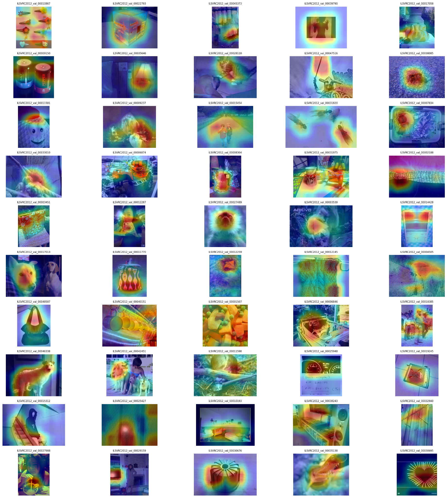
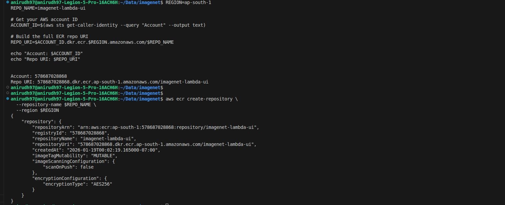
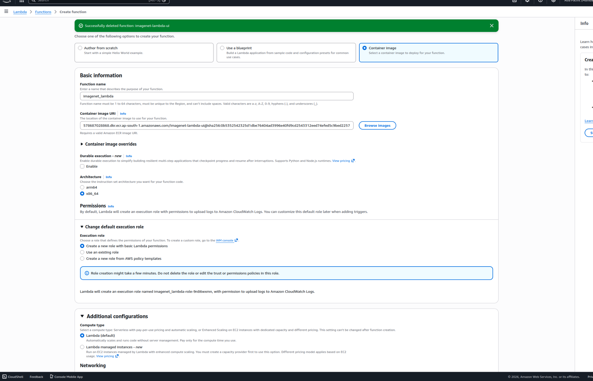
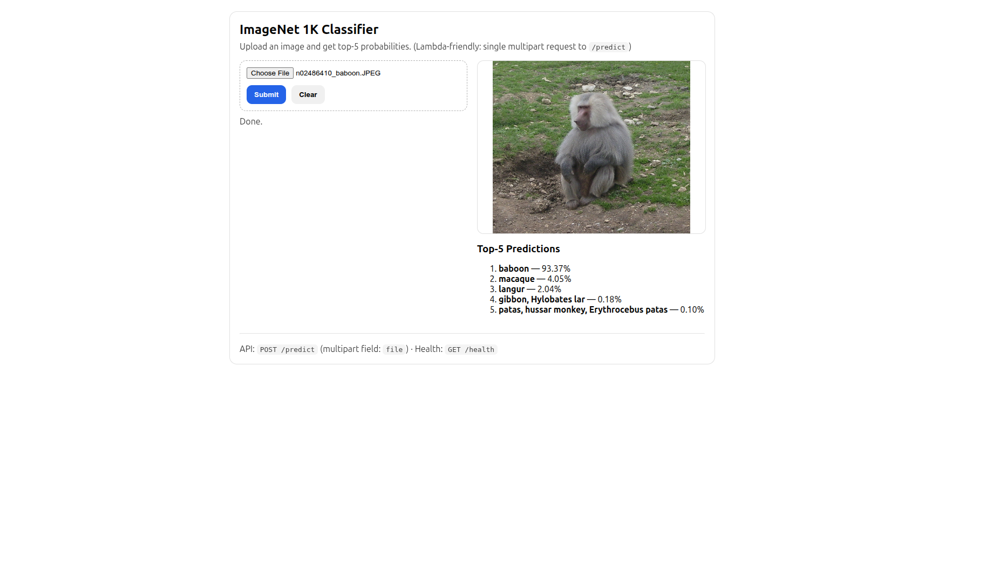
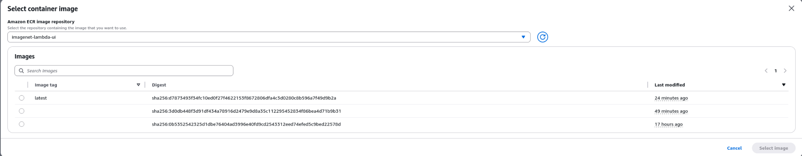

# ImageNet ResNet‑50: Training, Grad‑CAM Analysis, and Serverless ONNX Inference on AWS Lambda

This project covers an end‑to‑end workflow around an ImageNet‑1K **ResNet‑50** model:

- **Training pipeline (PyTorch)** with speed‑focused techniques (AMP, compile, progressive resize, DDP).
- **Model analysis / explainability** using **Grad‑CAM** to verify attention regions.
- **Production‑style inference service** using **ONNX Runtime + FastAPI**, packaged as a **Docker container** and deployed to **AWS Lambda** via **Amazon ECR**.

---

## Live demo (AWS Lambda Function URL)

Region: **ap-south-1**

- **UI:** https://dwzu47pkfvxomul7qi5vnkpwvm0uzeyg.lambda-url.ap-south-1.on.aws/ui
- **Health:** https://dwzu47pkfvxomul7qi5vnkpwvm0uzeyg.lambda-url.ap-south-1.on.aws/health
- **Inference API:** https://dwzu47pkfvxomul7qi5vnkpwvm0uzeyg.lambda-url.ap-south-1.on.aws/predict

> Note: If you recreate the Lambda function, your Function URL will change.

---

## What’s deployed

A single container image runs:

- **Uvicorn** (ASGI server)
- **FastAPI** (HTTP API + HTML UI)
- **ONNX Runtime** (CPU inference)

AWS **Lambda Web Adapter** converts Lambda events into HTTP requests and forwards them to the Uvicorn server inside the container.

### Architecture

```mermaid
flowchart LR
  U[User Browser] -->|GET /ui| UI[HTML UI served by FastAPI]
  UI -->|POST /predict (multipart/form-data)| API[FastAPI /predict]
  API --> PRE[Preprocess: resize + normalize + NCHW]
  PRE --> ORT[ONNX Runtime Session]
  ORT --> TOPK[Softmax + Top‑K labels]
  TOPK --> UI

  subgraph AWS
    URL[Lambda Function URL] --> AD[Lambda Web Adapter]
    AD --> API
    ECR[(Amazon ECR Image)] --> L[Lambda]
    L --> URL
  end
```

---

## Screenshots

### Grad‑CAM analysis grid



### ECR repository creation (CLI)



### Lambda function creation (container image)



### Lambda UI inference result



---

## Repository layout

### Inference service

```text
imagenet_inference/
├── app/
│   ├── main.py                      # FastAPI + ONNX Runtime + HTML UI
│   ├── resnet50_imagenet_1k_final.onnx
│   └── labels.txt                   # ImageNet‑1K labels
├── Dockerfile
└── requirements.txt
```

### Training + analysis

Training utilities and analysis scripts live in the training part of the repository.
The Grad‑CAM artifact shown above was generated using the analysis utilities (see `imagenetreport.py`).

---

## Model analysis: Grad‑CAM (brief)

Grad‑CAM highlights the spatial regions that most influence a class prediction. It’s a quick sanity check that the model is attending to the object (and not purely background).

**Typical workflow used here:**

1. Run inference on a batch of validation images.
2. Compute Grad‑CAM heatmaps from the last convolutional block.
3. Overlay heatmaps on the original images.
4. Export a grid for quick visual review.

Artifact: `assets/gradcam_grid.png`.

---

## Inference service

### Endpoints

- `GET /ui` – HTML UI (upload + preview + top‑5 output)
- `POST /predict` – multipart inference endpoint
  - multipart field name: `file`
- `GET /health` – health check

> Tip: `curl -I` sends a **HEAD** request; if your `/ui` route only supports GET, you may see **405 Method Not Allowed**. Use `curl -i` (GET) instead.

---

## Run locally (Docker)

From `imagenet_inference/`:

```bash
docker build -t imagenet-lambda-ui .
# if 8080 is in use, map another host port
docker run --rm -p 9000:8080 imagenet-lambda-ui
```

Open:

- UI: http://localhost:9000/ui

### Test locally via curl

Health:

```bash
curl -i http://localhost:9000/health
```

Predict (multipart upload):

```bash
curl -i -X POST \
  -F "file=@/path/to/image.jpg" \
  http://localhost:9000/predict
```

---

## Deployment on AWS Lambda (container image)

This section documents the exact steps used to deploy the inference service to AWS Lambda.

### Why Docker + ECR?

- **Docker** packages the runtime, dependencies, ONNX model, and web server into one artifact.
- **Amazon ECR** stores container images.
- **AWS Lambda** can run container images directly from ECR.

### Prerequisites

- AWS account + IAM permissions for **ECR** and **Lambda**.
- AWS CLI configured:

```bash
aws configure
# Default region name: ap-south-1
# Default output format: json
```

- Docker or Podman (Podman may print: “Emulate Docker CLI using podman”).

---

### Step 1 — Create an ECR repository

```bash
REGION=ap-south-1
REPO_NAME=imagenet-lambda-ui
ACCOUNT_ID=$(aws sts get-caller-identity --query "Account" --output text)
ECR_REGISTRY=$ACCOUNT_ID.dkr.ecr.$REGION.amazonaws.com
ECR_URI=$ECR_REGISTRY/$REPO_NAME

aws ecr create-repository \
  --repository-name $REPO_NAME \
  --region $REGION 2>/dev/null || true
```

---

### Step 2 — Login to ECR

ECR auth tokens expire; rerun before each push:

```bash
aws ecr get-login-password --region $REGION \
  | docker login --username AWS --password-stdin $ECR_REGISTRY
```

---

### Step 3 — Build & push the Docker image

From `imagenet_inference/`:

```bash
docker build -t imagenet-lambda-ui .

TAG=htmlui-$(date +%Y%m%d-%H%M%S)
docker tag imagenet-lambda-ui:latest $ECR_URI:$TAG
docker push $ECR_URI:$TAG

echo "Pushed: $ECR_URI:$TAG"
```

Verify the tag exists:

```bash
aws ecr describe-images \
  --repository-name $REPO_NAME \
  --region $REGION \
  --query "imageDetails[?contains(imageTags, '$TAG')].[imageTags,imageDigest]" \
  --output json
```

---

### Step 4 — Create or update the Lambda function

#### Option A: Create via AWS Console

1. Lambda → **Create function**
2. Choose **Container image**
3. Select your ECR image + tag
4. Create



#### Option B: Update an existing function via CLI

```bash
FUNCTION_NAME=imagenet_lambda_final

aws lambda update-function-code \
  --function-name "$FUNCTION_NAME" \
  --image-uri "$ECR_URI:$TAG" \
  --region "$REGION"

aws lambda wait function-updated \
  --function-name "$FUNCTION_NAME" \
  --region "$REGION"
```

Recommended config (helps cold-start + ONNX load):

```bash
aws lambda update-function-configuration \
  --function-name "$FUNCTION_NAME" \
  --memory-size 1024 \
  --timeout 60 \
  --region "$REGION"

aws lambda wait function-updated \
  --function-name "$FUNCTION_NAME" \
  --region "$REGION"
```

---

### Step 5 — Create a Function URL (public)

If you don’t already have one:

```bash
aws lambda create-function-url-config \
  --function-name "$FUNCTION_NAME" \
  --auth-type NONE \
  --invoke-mode BUFFERED \
  --region "$REGION"
```

Allow public invoke:

```bash
aws lambda add-permission \
  --function-name "$FUNCTION_NAME" \
  --statement-id AllowPublicFunctionUrlInvoke \
  --action lambda:InvokeFunctionUrl \
  --principal "*" \
  --function-url-auth-type NONE \
  --region "$REGION"
```

Get the URL:

```bash
LAMBDA_URL=$(aws lambda get-function-url-config \
  --function-name "$FUNCTION_NAME" \
  --region "$REGION" \
  --query "FunctionUrl" \
  --output text)

BASE="${LAMBDA_URL%/}"
echo "$BASE"
```

---

### Step 6 — Test the deployed service

```bash
# Health
curl -i "$BASE/health"

# UI (GET)
curl -i "$BASE/ui"

# Predict
curl -i -X POST \
  -F "file=@/path/to/image.jpg" \
  "$BASE/predict"
```

---

## Troubleshooting (common)

### 1) `COPY main.py` / `COPY app.py` fails during docker build

Make sure your Docker build context matches your files. If `main.py` lives under `app/`, your Dockerfile should use:

```dockerfile
COPY app/ ./app/
```

### 2) `curl -I /ui` returns 405

`curl -I` sends a HEAD request. Use `curl -i` (GET), or add an explicit HEAD route.

### 3) Large pushes to ECR feel slow

ONNX models are large; first push uploads big layers. Subsequent pushes are faster if the model layer doesn’t change.

---

## Training pipeline (details)

The training section of the repository includes:

- Config system (CLI + Python)
- Progressive resize schedule
- AMP (FP16/BF16)
- `torch.compile`
- DDP multi‑GPU support

See the training docs/scripts in the repository for end‑to‑end commands and benchmarks.
